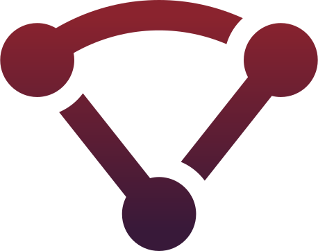

<h1 align="center">EDGEMESH</h1>

  
  
  
  
  
  

The purpose of this repository is to server as a knowledge base for edge**mesh** development.  Here you can request features, report bugs and find links to all the necessary resources to get started with edge**mesh**.  Please check all the [closed issues](https://github.com/edgemesh/edgemesh/issues?q=is%3Aissue+is%3Aclosed) and [wikis](https://github.com/edgemesh/edgemesh/wiki) for solutions to your problems before opening new issues.  You can also join our [discord](https://discord.gg/K5ACGha) for community support.

## Browser Support

The edge**mesh** client will install on any browser.  Edge**mesh** will automatically detect if the browser can support edge**mesh** and resume normal operation if full support is not detected.

As browser vendors add support for the latest web features that edge**mesh** utilizes, your edge**mesh** client will be automatically updated to add support.  Below is the current browser support for edge**mesh** as of  Q4 2018.

| Browser                                                                                                  | Market Share | Supported Versions | Blocked by                 |
|----------------------------------------------------------------------------------------------------------|--------------|--------------------|----------------------------|
|  | 63%       | >49            | ✅ Implemented              |
|  | 10%         | >58     | ✅ Implemented |
|  | 4%          | Not supported      | ❌ No webrtc datachannel support |
|  | 4%          | >12 | ✅ Implemented |
|  | 2% | >56 | ✅ Implemented |

## Device Support

Edge**mesh** Browser is supported on all iOS and Android devices.  Support for Windows devices is available using the above browsers.  An edge**mesh** mobile SDK is on our [roadmap](https://github.com/orgs/edgemesh/projects/8) to bring edge**mesh** support to native iOS and Android applications.

## Supernode Support

A super**node** is an edge**mesh** client in a single 6mb binary that can be compiled for any operating system and architecture. It can be installed on any hardware with a connection to the internet and some free storage.  The super**node** is self bootstrapping and requires no configuration to set up. 

To learn more about edge**mesh**'s product offerings go to [edgemesh.com](https://edgemesh.com). For partnership inquiries send an email to [contact@edgemesh.com](mailto:contact@edgemesh.com). 

  

  
  

